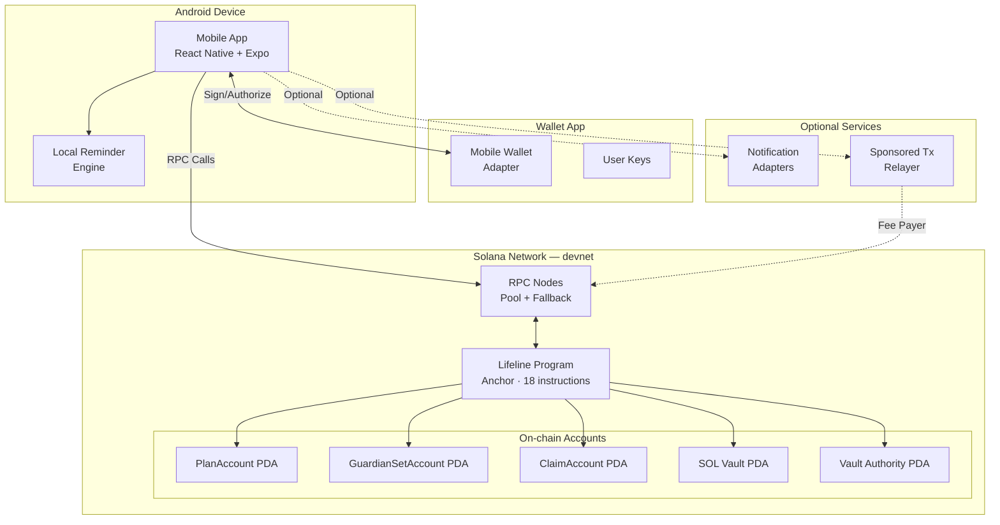
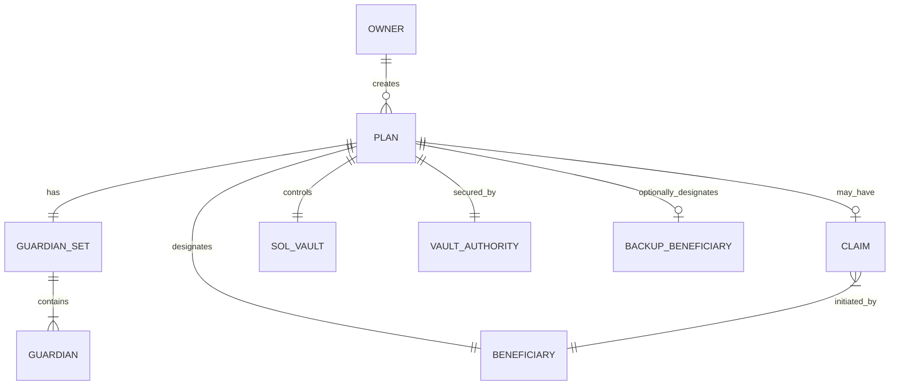
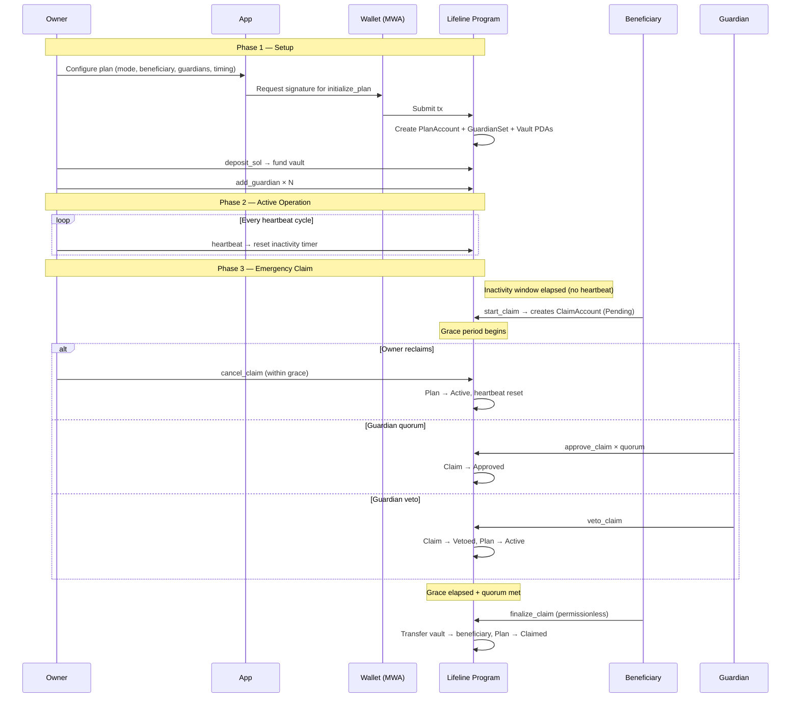
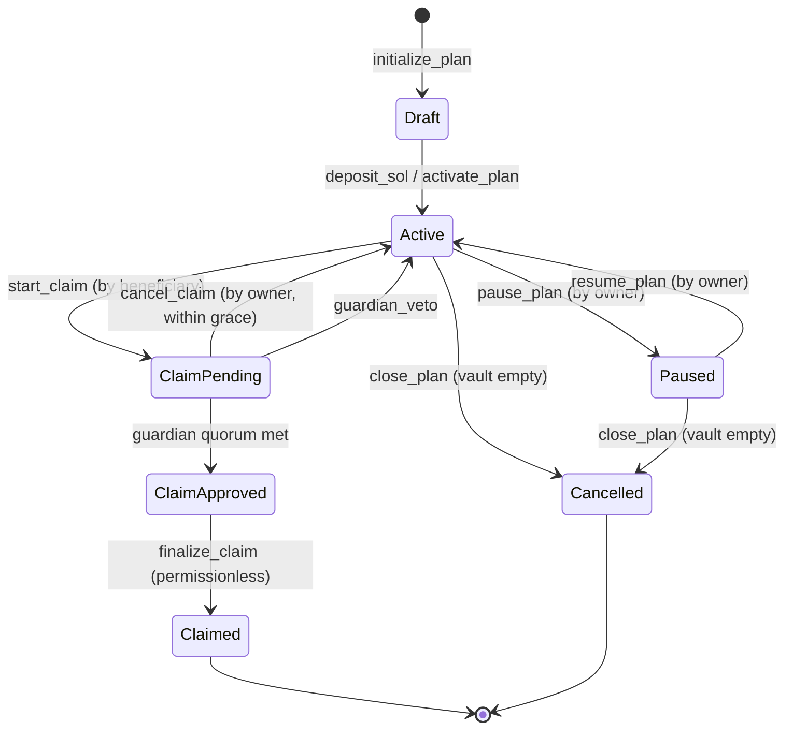
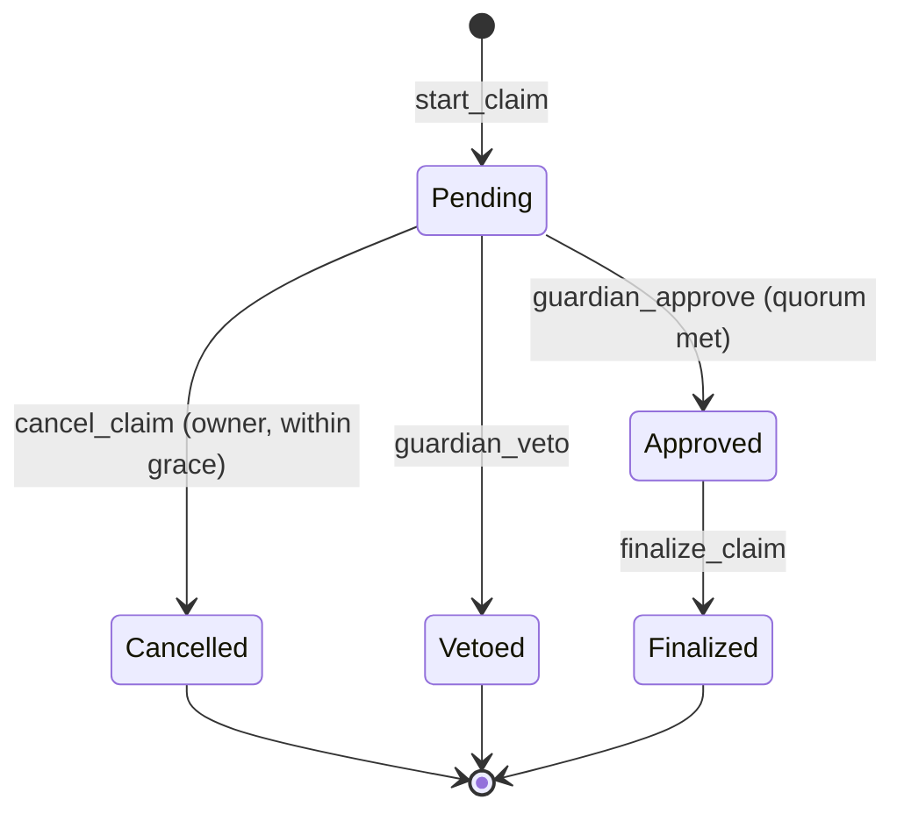
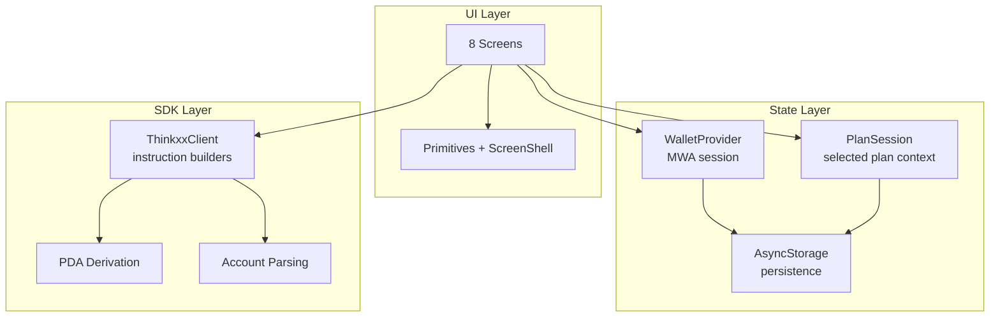
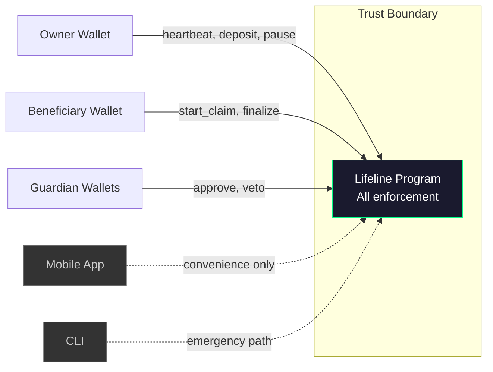
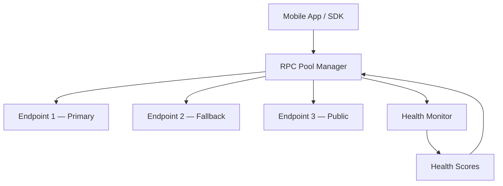

# Thinkxx

**Devnet-first, non-custodial Solana Mobile dApp for emergency access and inheritance planning.**

[](LICENSE)
[](https://explorer.solana.com/?cluster=devnet)
[](https://anchor-lang.com)
[](#test-suite)
[](https://expo.dev)

---

## What is Thinkxx?

Thinkxx enables users to create **time-locked emergency access policies** on Solana. If you become inactive — medical emergency, travel risk, or long-term absence — trusted beneficiaries can access your vault funds after a configurable waiting period, with guardian oversight and multi-stage claim verification.

All critical logic is enforced **on-chain** via an Anchor program. The mobile app is a convenience layer; the protocol works without it.

### What it is

- Emergency access protocol for digital assets on Solana
- Android-first mobile app optimized for Solana Seeker
- On-chain policy enforcement — 18 Anchor instructions
- Non-custodial — the app never touches private keys
- 185 bankrun-tested protocol, SDK, and mobile flows

### What it is NOT

- Not a wallet or key custodian
- Not a legal will or estate document
- Not a seed phrase manager or recovery service
- Not a DeFi protocol or yield farm

---

## Current Status

This is a **devnet MVP** (v0.1.0-devnet). It is not audited, not mainnet-ready, and does not yet include beneficiary claim-flow screens in the mobile app.

| Metric | Value |
|--------|-------|
| On-chain instructions | 18 |
| Test coverage | 185 tests (44 SDK + 72 mobile + 69 Anchor) |
| Mobile screens | 8 (owner-side flows) |
| SDK instruction builders | 15 |
| CLI commands | 10 |
| ADRs | 10 |
| Network | devnet only |

---

## Architecture

### System Overview



### Trust Model

| Component | Trust Level | Rationale |
|-----------|------------|-----------|
| Anchor Program | **Full** | All policy enforcement, timing, access control |
| Mobile App | **Zero** | Convenience layer; protocol works without it |
| SDK | **Zero** | Instruction builder; cannot bypass on-chain checks |
| Wallet (MWA) | **User-trusted** | Signs transactions; user controls wallet choice |
| RPC Nodes | **Transport** | Can censor but cannot forge; pool mitigates |
| Notification Adapters | **Zero** | UX redundancy; missed notifications don't break protocol |
| Sponsored Tx Relayer | **Zero** | Pays fees; cannot alter instruction semantics |

### Account Relationships



---

## How It Works

### Core Algorithm



### Timing Model

```
Owner creates plan              Inactivity window expires           Grace expires
│                              │                                   │
▼                              ▼                                   ▼
┌──────────────────────────────┐  ┌──────────────────────────────┐  ┌──────────────┐
│        Active State          │  │       Grace Period            │  │  Finalizable  │
│                              │  │                               │  │              │
│  Owner sends heartbeats      │  │  Owner can cancel_claim       │  │  Permissionless
│  to reset the timer.         │  │  Guardians vote approve/veto  │  │  finalize    │
│                              │  │                               │  │              │
│  last_heartbeat ─────────────┼──┼── + inactivity_duration ──────┼──┼── + grace ───┤
│                              │  │                               │  │   period     │
└──────────────────────────────┘  └──────────────────────────────┘  └──────────────┘
```

### Plan Modes

Default presets exposed by the mobile app. Users can customize timing before submitting.

| Mode | Default Inactivity | Default Grace | Use Case |
|------|:---------:|:-------:|----------|
| **Medical** | 30 days | 7 days | Surgery, hospitalization, or elevated medical risk |
| **LegalRisk** | 90 days | 14 days | Travel to high-risk jurisdictions or detention risk |
| **Legacy** | 365 days | 30 days | Long-horizon inheritance planning |

---

## State Machine

### Plan Lifecycle



### Claim Lifecycle



### Plan States

| State | Description | Allowed Actions |
|-------|-------------|-----------------|
| **Draft** | Plan created, vault empty | deposit, heartbeat, add guardian, close |
| **Active** | Funded, heartbeat running | heartbeat, deposit, pause, update, emergency withdraw |
| **ClaimPending** | Beneficiary initiated claim | cancel_claim (owner), guardian approve/veto |
| **ClaimApproved** | Guardian quorum met | finalize_claim |
| **Claimed** | Terminal: funds transferred | — |
| **Cancelled** | Terminal: plan closed | — |
| **Paused** | Temporarily suspended | resume, close |

---

## Protocol Instructions

### Complete Instruction Reference

| # | Instruction | Category | Signer | Description |
|---|-------------|----------|--------|-------------|
| 1 | `initialize_plan` | Lifecycle | Owner | Create PlanAccount, GuardianSet, and Vault PDAs |
| 2 | `activate_plan` | Lifecycle | Owner | Transition Draft → Active |
| 3 | `heartbeat` | Lifecycle | Owner | Reset `last_heartbeat` timestamp |
| 4 | `pause_plan` | Lifecycle | Owner | Active → Paused (stop inactivity timer) |
| 5 | `resume_plan` | Lifecycle | Owner | Paused → Active (reset timer) |
| 6 | `close_plan` | Lifecycle | Owner | Reclaim rent (Draft/Cancelled, vault empty) |
| 7 | `deposit_sol` | Vault | Owner | Transfer SOL into plan vault |
| 8 | `set_emergency_bucket` | Vault | Owner | Set emergency withdrawal allocation |
| 9 | `emergency_withdraw` | Vault | Owner | Withdraw from emergency bucket |
| 10 | `add_guardian` | Guardian | Owner | Add guardian to set (max 5) |
| 11 | `remove_guardian` | Guardian | Owner | Remove guardian, revalidate quorum |
| 12 | `start_claim` | Claim | Beneficiary | Initiate claim after inactivity window |
| 13 | `cancel_claim` | Claim | Owner | Cancel claim during grace period |
| 14 | `approve_claim` | Claim | Guardian | Record guardian approval |
| 15 | `veto_claim` | Claim | Guardian | Immediate claim cancellation |
| 16 | `finalize_claim` | Claim | Any (permissionless) | Transfer vault to beneficiary |
| 17 | `update_beneficiary` | Update | Owner | Change beneficiary address |
| 18 | `update_timing` | Update | Owner | Adjust inactivity/grace periods |

### On-chain Accounts

| Account | PDA Seeds | Purpose |
|---------|-----------|---------|
| `PlanAccount` | `["plan", owner, plan_id]` | Core policy: state, timing, beneficiary |
| `GuardianSetAccount` | `["guardian_set", plan]` | Guardian roster and quorum |
| `ClaimAccount` | `["claim", plan]` | Active claim tracking |
| `SOL Vault` | `["sol_vault", plan]` | Deposited SOL |
| `Vault Authority` | `["vault_authority", plan]` | PDA signer for vault transfers (no private key) |

### Error Codes

| Code | Name | Description |
|------|------|-------------|
| 6000 | `InvalidPlanState` | Operation not valid for current plan state |
| 6001 | `InactivityWindowNotElapsed` | Too early to start a claim |
| 6002 | `GracePeriodNotElapsed` | Grace period still active |
| 6003 | `GracePeriodExpired` | Owner window for cancel has passed |
| 6004 | `QuorumNotMet` | Not enough guardian approvals |
| 6005 | `NotBeneficiary` | Signer is not the designated beneficiary |
| 6006 | `NotGuardian` | Signer is not a registered guardian |
| 6007 | `NotOwner` | Signer is not the plan owner |
| 6008 | `AlreadyApproved` | Guardian already approved this claim |
| 6009 | `AlreadyVetoed` | Guardian already vetoed this claim |
| 6010 | `ClaimAlreadyExists` | A claim is already in progress |
| 6011 | `PlanNotActive` | Plan must be Active |
| 6012 | `VaultNotEmpty` | Cannot close plan with funds remaining |
| 6013 | `UnsupportedToken` | Token mint not in allowlist |
| 6014–6016 | `PendingUpdate*` | Update delay not met or conflict |
| 6017 | `GuardianSetFull` | Max 5 guardians reached |
| 6018 | `GuardianNotFound` | Guardian not in set |
| 6019 | `InvalidQuorum` | Invalid quorum value |
| 6020 | `EmergencyBucketExceeded` | Withdrawal exceeds allocation |
| 6021 | `PlanNotPaused` | Plan must be Paused for resume |
| 6022 | `InvalidTimingParameter` | Timing value out of bounds |
| 6023 | `DuplicateGuardian` | Guardian already in set |

---

## Project Structure

```
thinkxx/
├── apps/
│   └── mobile/                     # React Native + Expo owner console
│       └── src/
│           ├── screens/            # 8 screens (Connect, Dashboard, CreatePlan, etc.)
│           ├── components/         # Primitives, ScreenShell, color, layout
│           ├── providers/          # WalletProvider (MWA)
│           ├── state/              # plan-session, wallet-session, storage
│           └── theme.ts            # Dark-first design tokens
│
├── programs/
│   └── lifeline/                   # Anchor program (Solana)
│       └── src/
│           ├── lib.rs              # Program entry + 18 instruction handlers
│           ├── state.rs            # PlanAccount, GuardianSetAccount, ClaimAccount
│           ├── error.rs            # 24 custom error codes
│           └── instructions/       # 18 instruction modules
│
├── packages/
│   ├── sdk/                        # TypeScript SDK
│   │   └── src/
│   │       ├── client.ts           # ThinkxxClient (15 builders)
│   │       ├── accounts.ts         # Account parsing + fetch helpers
│   │       ├── pda.ts              # PDA derivation (5 functions)
│   │       ├── sponsored.ts        # SponsoredTransactionBuilder
│   │       └── index.ts            # Public API
│   ├── cli/                        # Emergency CLI (10 commands)
│   ├── config/                     # Shared constants, types, network config
│   ├── notifications/              # Console + Telegram adapters
│   └── rpc/                        # RPC resilience + retry layer
│
├── tests/                          # 69 bankrun-based Anchor integration tests
├── docs/                           # 15 spec documents + 10 ADRs
├── .github/                        # CI workflows, templates, CODEOWNERS
├── AGENTS.md                       # Coding conventions for AI and humans
├── CHANGELOG.md                    # Version history (Keep a Changelog)
├── CONTRIBUTING.md                 # Developer guide
├── DECISIONS.md                    # 10 engineering decisions
├── SECURITY.md                     # Vulnerability reporting
└── LICENSE                         # Apache 2.0
```

---

## Quick Start

### Prerequisites

| Tool | Version | Purpose |
|------|---------|---------|
| Node.js | ≥ 20 | Runtime |
| pnpm | ≥ 9 | Package manager |
| Rust | stable | Anchor program |
| Anchor CLI | 0.30.1 | Solana framework |
| Solana CLI | 2.0+ | Deploy only (not needed for tests) |
| Android Studio | latest | Mobile development |

### Setup

```bash
git clone https://github.com/sapirl7/thinkxx.git
cd thinkxx
nvm use              # reads .nvmrc → Node 20
pnpm install
pnpm run build
```

> **Toolchain pinning**: the repo includes [`.nvmrc`](.nvmrc) for Node.js and [`rust-toolchain.toml`](rust-toolchain.toml) for Rust. `nvm use` and `rustup` will pick them up automatically.

### Using the Makefile

A [`Makefile`](Makefile) provides a unified DX layer across all stacks:

```bash
make help            # list all targets
make check           # lint + format-check + clippy (no tests)
make test-all        # SDK + mobile + Anchor
make audit           # cargo audit + pnpm audit
make ci              # full CI reproduction locally
```

### Anchor Program

```bash
# Build the program
anchor build

# Run integration tests (bankrun — no validator needed)
pnpm run test:anchor

# Deploy to devnet
solana config set --url devnet
anchor deploy
```

### Mobile App

```bash
cd apps/mobile
npx expo start
npx expo run:android
```

### CLI (Emergency Access)

```bash
# Check plan status
thinkxx status -o <owner-pubkey>

# Send heartbeat
thinkxx heartbeat -p <plan-pubkey> -k <keypair-path>

# Emergency withdrawal
thinkxx emergency-withdraw -p <plan-pubkey> -k <keypair-path> -a 0.5

# Guardian management
thinkxx guardian add -p <plan> -k <keypair> -g <guardian-pubkey>
thinkxx guardian remove -p <plan> -k <keypair> -g <guardian-pubkey>
```

---

## SDK Reference

### Installation

```bash
pnpm add @thinkxx/sdk @thinkxx/config
```

### Build Instructions

```typescript
import { ThinkxxClient, PlanMode } from '@thinkxx/sdk';
import { Connection, PublicKey, Keypair } from '@solana/web3.js';

const connection = new Connection('https://api.devnet.solana.com');
const client = new ThinkxxClient(connection);
const owner = new PublicKey('...');

// Create a plan
const { instruction, planPda, guardianSetPda } = client.buildInitializePlan(owner, {
  planId: BigInt(1),
  mode: PlanMode.Medical,
  beneficiary: new PublicKey('...'),
  inactivityDuration: BigInt(30 * 86400),  // 30 days
  gracePeriod: BigInt(7 * 86400),           // 7 days
  guardianQuorum: 2,
});

// Heartbeat
const heartbeatIx = client.buildHeartbeat(owner, planPda);

// Deposit SOL
const depositIx = client.buildDepositSol(owner, planPda, BigInt(1_000_000_000));

// Add guardian
const addGuardianIx = client.buildAddGuardian(owner, planPda, guardianSetPda, guardianPubkey);
```

### PDA Derivation

```typescript
import {
  derivePlanPda,
  deriveGuardianSetPda,
  deriveClaimPda,
  deriveVaultAuthorityPda,
  deriveSolVaultPda,
} from '@thinkxx/sdk';

const [planPda, planBump]           = derivePlanPda(ownerPubkey, planId);
const [guardianSetPda, gsBump]     = deriveGuardianSetPda(planPda);
const [claimPda, claimBump]        = deriveClaimPda(planPda);
const [vaultAuthority, vaBump]     = deriveVaultAuthorityPda(planPda);
const [solVault, svBump]           = deriveSolVaultPda(planPda);
```

### Sponsored Transactions (Gasless UX)

```typescript
import { SponsoredTransactionBuilder } from '@thinkxx/sdk';

const sponsored = new SponsoredTransactionBuilder(connection, {
  feePayer: relayerKeypair,
  maxFeePerTx: 10_000,
});

// Build and partial-sign — user only needs to add their signature
const serializedTx = await sponsored.buildAndPartialSign([startClaimIx]);
```

---

## Mobile App

### Screen Map

| Screen | Purpose |
|--------|---------|
| **Connect** | Establish owner wallet session via MWA |
| **Dashboard** | Wallet balance, discovered plans, quick actions |
| **Create Plan** | Configure and provision a new plan |
| **Plan Detail** | Inspect plan state, vault, heartbeat status |
| **Heartbeat** | Record owner activity for selected plan |
| **Deposit** | Move SOL from wallet into plan vault |
| **Guardians** | Review quorum, add/remove guardians |
| **Settings** | Connection metadata, app identity, endpoint |

### Mobile Architecture



### Design Direction

- Dark-first control-room interface
- Teal + amber accent system
- Restrained motion; strong status hierarchy
- Plan-bound actions: all operations tied to a resolved `planPda`
- No PII displayed; only pubkeys, states, and timestamps

---

## Test Suite

### Overview

| Suite | Tests | Runner | Environment |
|-------|:-----:|--------|-------------|
| **SDK** | 44 | Vitest | Node.js |
| **Mobile** | 70 | Jest | React Native |
| **Anchor** | 69 | ts-mocha | Bankrun (in-process SVM) |
| **Total** | **183** | | |

### Running Tests

```bash
# Individual suites
pnpm run test:sdk        # 44 SDK tests
pnpm run test:mobile     # 70 mobile tests
pnpm run test:anchor     # 69 Anchor tests (bankrun, no validator)

# Combined
pnpm run test:all:local  # SDK + Mobile
pnpm run test:full:local # SDK + Mobile + Anchor
```

### Bankrun Architecture

All Anchor integration tests use [`anchor-bankrun`](https://github.com/coral-xyz/anchor/tree/master/ts/packages/anchor-bankrun) for **deterministic, in-process** testing:

- **No validator needed**: `startAnchor('.')` boots a local SVM runtime
- **Deterministic time**: `context.setClock()` for time-warp (inactivity windows, grace deadlines)
- **Fast**: Full 69-test suite runs in ~2 seconds
- **Isolated**: Each test gets fresh keypairs and unique PDAs

### What's Tested

| Category | Coverage |
|----------|----------|
| Plan initialization | Draft state, PDA creation, parameter validation |
| State transitions | All 7 states, guard conditions |
| Guardian management | Add/remove, max 5, quorum math |
| Claim flow | start, cancel, approve, veto, finalize |
| Emergency bucket | Set, withdraw, exceed |
| Timing validation | Inactivity window, grace period, edge cases |
| PDA derivation | All 5 derivation functions |
| Security invariants | Signer checks, wrong-owner, wrong-beneficiary, wrong-guardian |

### CI Pipeline

| Job | What | Required |
|-----|------|:--------:|
| `lint-and-typecheck` | ESLint + TypeScript strict | Yes |
| `rust-checks` | `cargo fmt --check` + `clippy -D warnings` | Yes |
| `anchor-build` | `anchor build` | Yes |
| `sdk-test` | `pnpm run test:sdk` | Yes |
| `mobile-test` | `pnpm run test:mobile` | Yes |
| `anchor-test` | `pnpm run test:anchor` (bankrun) | Yes |
| `verify-generated` | `git diff --exit-code` on IDL/types | Yes |
| `cargo-audit` | RustSec dependency scan | Yes |
| `pnpm-audit` | npm advisory scan (prod, high+) | Yes |

---

## Security

### Security Model



### Key Security Properties

1. **Non-custodial** — app never holds private keys, all signing via MWA
2. **On-chain enforcement** — timing, access control, and state transitions are program-enforced
3. **Vault authority is a PDA** — no private key exists; transfers require program CPI
4. **Delayed updates** — beneficiary and guardian changes enforce 3–14 day delays
5. **Single veto** — any guardian can immediately cancel a pending claim
6. **Emergency exit** — CLI provides protocol access independent of the mobile app
7. **Metadata minimization** — only pubkeys and timing on-chain, no PII

### Threat Model Summary

| Threat | Severity | Mitigation |
|--------|:--------:|------------|
| Owner key compromise | MEDIUM | Delayed updates, guardian oversight |
| Beneficiary key compromise | LOW | Guardian quorum, grace period |
| Guardian collusion | MEDIUM | Owner cancel during grace |
| Timing manipulation | VERY LOW | On-chain clock consensus |
| RPC censorship | LOW | Provider pool, CLI fallback |
| App compromise | VERY LOW | Non-custodial, MWA isolation |

Full analysis: [THREAT_MODEL.md](docs/THREAT_MODEL.md)

---

## RPC Resilience



- Health scoring: latency (40%) + success rate (40%) + freshness (20%)
- Separate read/write paths with independent retry policies
- Graceful degradation to read-only mode when writes fail
- Blockhash caching with automatic refresh on `BlockhashNotFound`

Full details: [RPC_STRATEGY.md](docs/RPC_STRATEGY.md)

---

## Documentation

| Document | Description |
|----------|-------------|
| [Architecture](docs/ARCHITECTURE.md) | System design, trust model, data flows |
| [Protocol Spec](docs/PROTOCOL_SPEC.md) | Anchor program specification, accounts, instructions |
| [State Machine](docs/STATE_MACHINE.md) | All state transitions with guard conditions |
| [Threat Model](docs/THREAT_MODEL.md) | STRIDE-based security analysis (12 threats) |
| [Testing Guide](docs/TESTING.md) | Test commands, bankrun architecture, helpers |
| [Mobile UX](docs/MOBILE_UX.md) | Owner-side mobile flows and design direction |
| [Token Support](docs/TOKEN_SUPPORT_MATRIX.md) | Supported tokens and Token-2022 extension evaluation |
| [RPC Strategy](docs/RPC_STRATEGY.md) | Network resilience and health scoring |
| [Notifications](docs/NOTIFICATIONS.md) | Alert architecture and adapter interface |
| [Sponsored Txs](docs/SPONSORED_TXS.md) | Gasless fee-payer design |
| [Audit Report](docs/AUDIT_REPORT.md) | Security and code quality audit |
| [Release Readiness](docs/RELEASE_READINESS.md) | Release checklist and status |
| [Publish Safe](docs/PUBLISH_SAFE.md) | Repository hygiene checklist |
| [Changelog](CHANGELOG.md) | Version history |
| [Decisions](DECISIONS.md) | Engineering decision log (10 decisions) |
| [10 ADRs](docs/adr/) | Architecture Decision Records |

---

## Tech Stack

| Layer | Technology | Purpose |
|-------|-----------|---------|
| Mobile app | React Native + Expo, TypeScript | Owner console |
| Wallet integration | Mobile Wallet Adapter (MWA) | Non-custodial signing |
| On-chain program | Anchor 0.30.1 (Rust) | Protocol enforcement |
| Build system | pnpm 9 + Turborepo | Monorepo orchestration |
| SDK | TypeScript, `@solana/web3.js` | Instruction building, PDA derivation |
| CLI | TypeScript, Commander.js | Emergency access |
| Notifications | Pluggable adapters | Console, Telegram |
| Testing | Vitest + Jest + ts-mocha + bankrun | SDK, mobile, Anchor |
| CI | GitHub Actions | Lint, build, test gates |
| Network | Solana devnet | Current deployment target |

---

## Important Disclaimers

- This is **experimental software** deployed on **devnet only**
- A formal security **audit has not been completed**
- This is **not legal advice** and does not replace estate planning
- Public blockchain activity is **publicly observable**
- Users must **independently verify** beneficiary addresses and legal arrangements

---

## Contributing

See [CONTRIBUTING.md](CONTRIBUTING.md) for development setup and guidelines.

## Security

See [SECURITY.md](SECURITY.md) for vulnerability reporting.

## License

Apache 2.0 — see [LICENSE](LICENSE).
