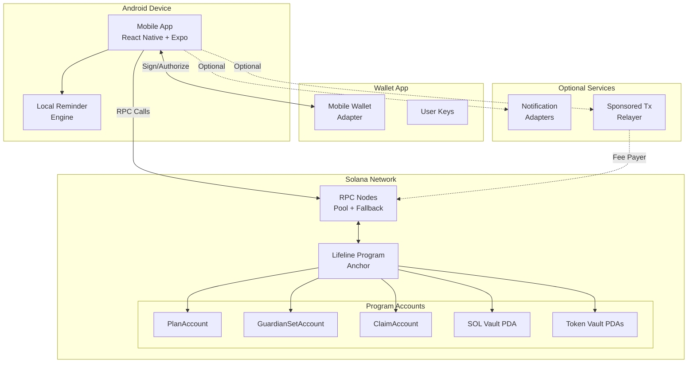
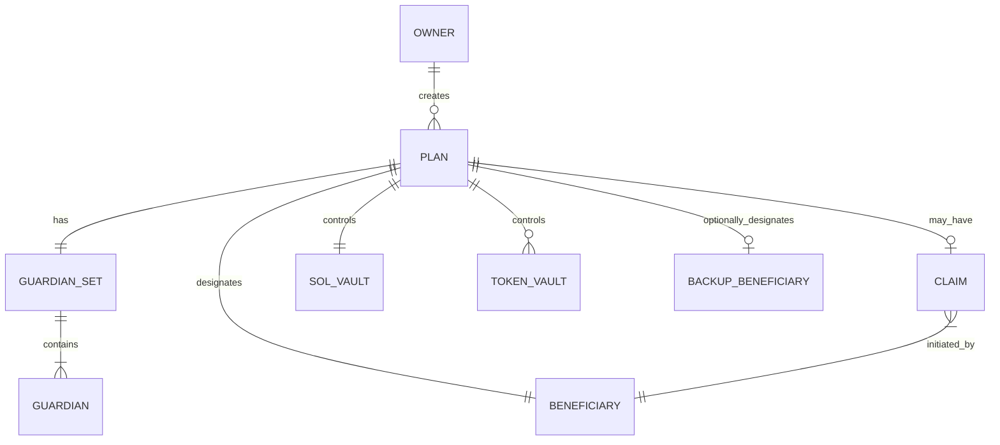
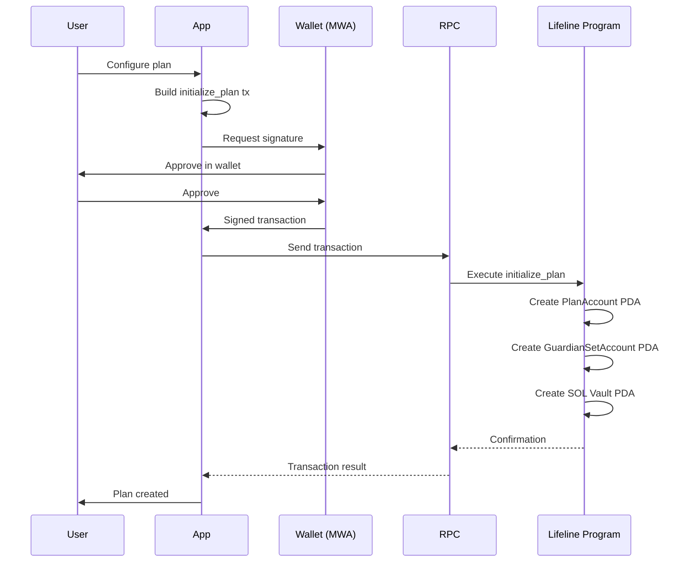
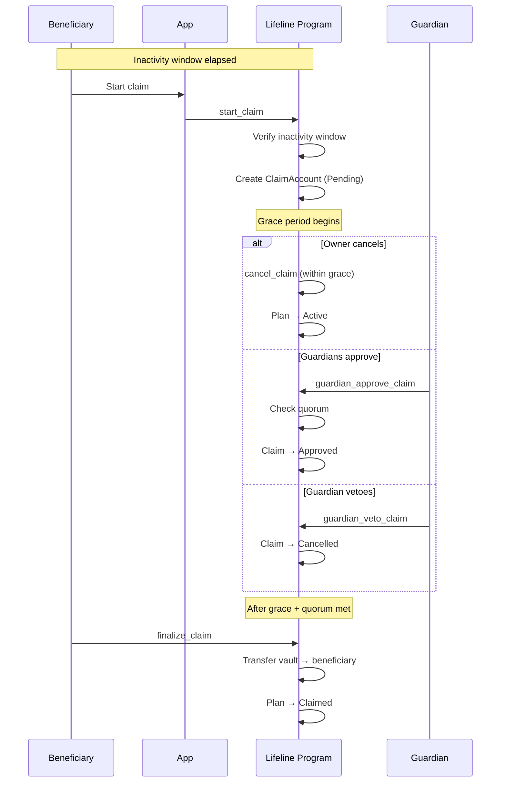

# Architecture

## Overview

Thinkxx is a non-custodial Solana Mobile dApp for emergency access and inheritance planning. The architecture follows a **serverless, trust-minimized** design where all critical logic lives on-chain in an Anchor program.

## System Architecture



## Trust Model

| Component | Trust Level | Rationale |
|-----------|------------|-----------|
| Anchor Program | **Full** | All policy enforcement, timing, access control |
| Mobile App | **Zero** | Convenience layer; protocol works without it |
| SDK | **Zero** | Instruction builder; cannot bypass on-chain checks |
| Wallet (MWA) | **User-trusted** | Signs transactions; user controls wallet choice |
| RPC Nodes | **Transport** | Can censor but cannot forge; pool mitigates |
| Notification Adapters | **Zero** | UX redundancy; missed notifications don't break protocol |
| Sponsored Tx Relayer | **Zero** | Pays fees; cannot alter instruction semantics |

## Core Design Principles

1. **On-chain enforcement**: All timing, access control, and state transitions are enforced by the Anchor program
2. **Non-custodial**: The app never holds private keys; all signing via MWA
3. **Explicit state machine**: Named states with explicit guard conditions
4. **Metadata minimization**: Only execution-critical data on-chain
5. **Graceful degradation**: Works without backend, notifications, or specific RPC providers
6. **Emergency resilience**: Protocol usable via CLI even if mobile app disappears

## Account Relationships



## Data Flow: Plan Creation



## Data Flow: Claim Process



## Package Dependencies

```
apps/mobile
├── @thinkxx/sdk
├── @thinkxx/config
├── @thinkxx/rpc
└── @thinkxx/notifications

packages/sdk
├── @coral-xyz/anchor
├── @solana/web3.js
└── @thinkxx/config

packages/cli
├── @thinkxx/sdk
├── @thinkxx/config
└── commander

packages/rpc
├── @solana/web3.js
└── @thinkxx/config

packages/notifications → adapter interfaces only
packages/config → shared constants, types, network config
```

## Milestone Gates

| Gate | Criteria |
|------|----------|
| **M1** | Repo scaffold, docs skeleton, CI green |
| **M2** | Wallet connect, minimal plan + heartbeat on devnet |
| **M3** | Claim flow, guardian support, docs reflect implementation |
| **M4** | Sponsorship, notifications, RPC resilience, token matrix enforced |
| **M5** | Hardening, release docs, production-readiness assessment |
