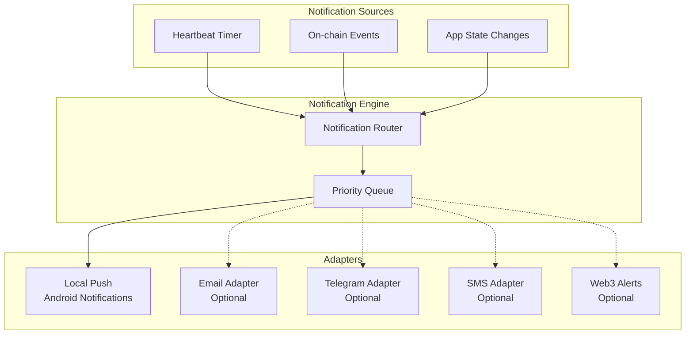

# Notification Architecture

## Design Principles

1. **Notifications are UX redundancy, not protocol correctness** — missed notifications never break protocol validity
2. **No single vendor dependency** — adapters are replaceable
3. **Graceful degradation** — provider failure doesn't crash the app
4. **Modular adapters** — add new channels without changing core logic

## Architecture



## Notification Types

| Event | Recipients | Priority | Channels |
|-------|-----------|----------|----------|
| Heartbeat reminder | Owner | HIGH | Local push, Email, Telegram |
| Heartbeat overdue | Owner, Guardians | CRITICAL | All configured |
| Claim started | Owner, Guardians | CRITICAL | All configured |
| Grace period expiring | Owner | CRITICAL | All configured |
| Claim cancelled | Beneficiary, Guardians | MEDIUM | Local push, Email |
| Guardian vote needed | Guardian | HIGH | Local push, Email, Telegram |
| Claim finalized | All parties | HIGH | All configured |
| Beneficiary update pending | Owner, Beneficiary | MEDIUM | Local push |
| Guardian update pending | Owner, Guardians | MEDIUM | Local push |

## Adapter Interface

```typescript
interface NotificationAdapter {
  readonly name: string;
  readonly isAvailable: boolean;

  send(notification: Notification): Promise<NotificationResult>;
  configure(config: AdapterConfig): Promise<void>;
  healthCheck(): Promise<boolean>;
}

interface Notification {
  type: NotificationType;
  recipient: string; // pubkey or external identifier
  title: string;
  body: string;
  priority: 'low' | 'medium' | 'high' | 'critical';
  data?: Record<string, unknown>;
}

interface NotificationResult {
  success: boolean;
  adapter: string;
  error?: string;
}
```

## v1 Implementation

### Local Push Notifications (Android)
- React Native local notifications via `expo-notifications`
- Scheduled heartbeat reminders based on plan configuration
- Background task for checking on-chain state (battery-optimized)

### Adapter Stubs
- Email, Telegram, SMS, Web3 adapters defined as interfaces
- Concrete implementations planned for Phase 4
- Configuration UI shows available vs. configured adapters

## Failure Handling

| Failure | Behavior |
|---------|----------|
| Adapter throws | Log error, try next adapter, don't crash |
| All adapters fail | Log warning, user sees status in app next time |
| Network unavailable | Queue notifications locally, retry on reconnect |
| Adapter returns partial success | Mark as delivered for successful channels |
