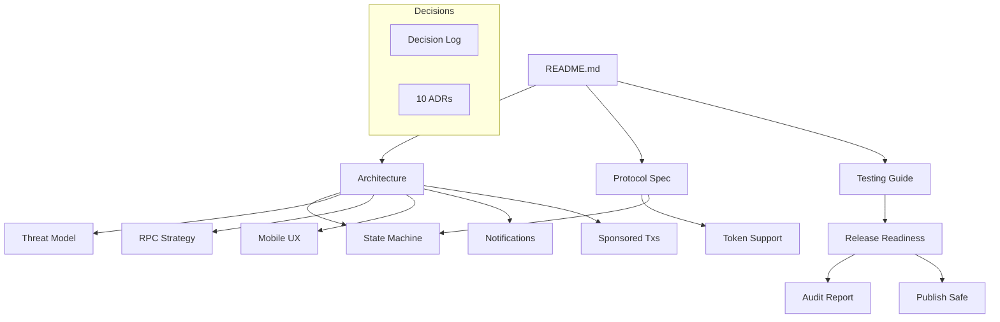

# Thinkxx Documentation

> Navigation index for the Thinkxx project documentation.

## Quick Start (10 minutes)

- **[README](../README.md)** — Overview, architecture, quickstart, SDK reference
- **[Protocol Spec](PROTOCOL_SPEC.md)** — What the on-chain program does
- **[Testing Guide](TESTING.md)** — How to run and understand the 183-test suite

## Architecture Deep Dive (1 hour)

- **[Architecture](ARCHITECTURE.md)** — System design, trust model, data flows
- **[State Machine](STATE_MACHINE.md)** — All plan/claim state transitions with guard conditions
- **[Threat Model](THREAT_MODEL.md)** — STRIDE-based security analysis (12 threats)
- **[Token Support](TOKEN_SUPPORT_MATRIX.md)** — Supported tokens and Token-2022 extensions

## Implementation Details

- **[Mobile UX](MOBILE_UX.md)** — Owner-side mobile flows and design direction
- **[RPC Strategy](RPC_STRATEGY.md)** — Network resilience, health scoring, retry policies
- **[Notifications](NOTIFICATIONS.md)** — Alert architecture and adapter interface
- **[Sponsored Txs](SPONSORED_TXS.md)** — Gasless fee-payer design for claim flows

## Operations & Release

- **[Audit Report](AUDIT_REPORT.md)** — Security and code quality findings
- **[Release Readiness](RELEASE_READINESS.md)** — Release checklist and status
- **[Publish Safe](PUBLISH_SAFE.md)** — Repository hygiene checklist
- **[dApp Store Listing](DAPP_STORE_LISTING.md)** — Solana dApp Store submission materials

## Decision Records

- **[Decision Log](../DECISIONS.md)** — Top-level engineering decisions
- **[ADRs](adr/)** — 10 Architecture Decision Records

## Document Map

