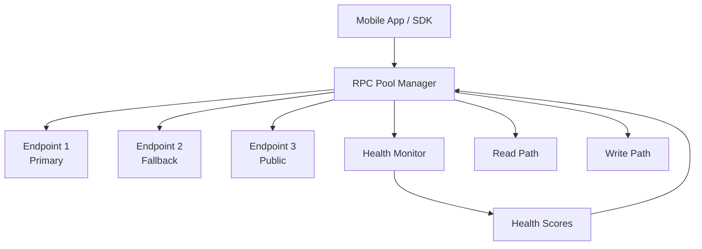

# RPC Strategy

## Design Principles

1. **Never depend on a single RPC endpoint**
2. **Treat transport errors differently from protocol errors**
3. **Degrade gracefully** — read-only mode when writes fail
4. **Mobile-first** — respect battery and bandwidth constraints

## Architecture



## Endpoint Configuration

```typescript
interface RpcEndpoint {
  url: string;
  name: string;
  priority: number;        // Lower = preferred
  rateLimit: number;        // Requests per second
  healthScore: number;      // 0-100, updated by health monitor
  supportsWebSocket: boolean;
  isPublic: boolean;        // True for public RPCs
}
```

### Default Configuration (devnet)
| Priority | Endpoint | Type |
|----------|----------|------|
| 1 | User-configured private (Helius, QuickNode) | Private |
| 2 | `https://api.devnet.solana.com` | Public |
| 3 | Additional public endpoints | Public |

## Health Scoring

Health scores are updated based on:
- **Latency**: Response time (weighted 40%)
- **Success rate**: Successful responses / total requests (weighted 40%)
- **Freshness**: Last successful response recency (weighted 20%)

```
health = (latency_score * 0.4) + (success_score * 0.4) + (freshness_score * 0.2)
```

### Health Score Thresholds
| Score | Status | Action |
|-------|--------|--------|
| 80-100 | Healthy | Normal routing |
| 50-79 | Degraded | Reduced weight, increase monitoring |
| 0-49 | Unhealthy | Skip unless only option |

## Retry Policy

| Parameter | Read Operations | Write Operations |
|-----------|:---------:|:----------:|
| Max retries | 3 | 5 |
| Base backoff | 500ms | 1s |
| Max backoff | 5s | 30s |
| Backoff strategy | Exponential | Exponential + jitter |
| Timeout | 10s | 30s |

## Read vs. Write Separation

| Operation | Path | Retry | Fallback |
|-----------|------|-------|----------|
| `getAccountInfo` | Read | Yes, all endpoints | Return cached if all fail |
| `getBalance` | Read | Yes, all endpoints | Return cached / stale |
| `sendTransaction` | Write | Yes, primary → fallback | Error to user |
| `getLatestBlockhash` | Read | Yes, all endpoints | Refresh and retry |
| `simulateTransaction` | Read | Yes, primary → fallback | Skip simulation |
| `confirmTransaction` | Read | Yes, primary only | Poll retry |

## Blockhash Handling

1. Fetch `getLatestBlockhash` with `confirmed` commitment
2. Cache with `lastValidBlockHeight`
3. If transaction fails with `BlockhashNotFound`, refetch and retry
4. Max 3 blockhash refresh attempts per transaction

## Degraded Mode

When the write path is unhealthy:

```
┌─────────────────────────────────┐
│  ⚠️ Limited Connectivity        │
│                                 │
│  You can view your plan status  │
│  but transactions may fail.     │
│                                 │
│  Heartbeat and claims           │
│  will retry automatically.      │
└─────────────────────────────────┘
```

- Dashboard shows cached/stale data with timestamp
- Heartbeat queued for retry when connection restores
- Clear visual indicator of degraded state

## Error Classification

| Error Class | User Message | Action |
|------------|-------------|--------|
| Network timeout | "Connection slow, retrying..." | Auto retry |
| RPC rate limited | "Busy network, retrying..." | Backoff + fallback |
| RPC unavailable | "Connecting to backup..." | Switch endpoint |
| All RPCs down | "Offline mode — limited features" | Degraded mode |
| Transaction rejected | "Transaction failed: [reason]" | Show specific error |
| Insufficient SOL | "Not enough SOL for fees" | Show balance |

## Implementation

The `@thinkxx/rpc` package exports:
- `RpcPoolManager` — manages endpoint pool, health, routing
- `RpcHealthMonitor` — background health checks
- `RetryPolicy` — configurable retry logic
- `BlockhashManager` — fresh blockhash caching
