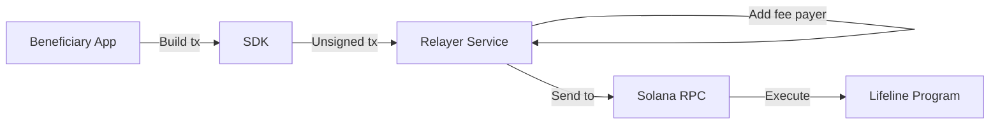

# Sponsored Transactions

## Problem

Beneficiaries and guardians may need to interact with the protocol during emergencies when they have zero SOL for transaction fees. This is especially critical for:
- `start_claim` — beneficiary initiating access after owner inactivity
- `guardian_approve` — guardian approving a claim
- `finalize_claim` — completing the claim process

## Design

### Architecture

### Trust Model

The relayer is a **convenience layer**, not a trust anchor.

| Property | Status |
|----------|--------|
| Can alter instruction arguments | **NO** — tx is pre-signed by user |
| Can bypass on-chain checks | **NO** — program enforces all constraints |
| Can censor transactions | **YES** — but user can use any other fee payer |
| Protocol works without relayer | **YES** — fully functional with user-paid fees |

### Sponsored Instruction Allowlist

Only these instructions may be sponsored:
- `start_claim`
- `guardian_approve`
- `guardian_veto`
- `finalize_claim`

Owner instructions (heartbeat, deposit, plan management) are **never** sponsored — the owner is expected to have SOL.

### Flow

1. User builds transaction with all required signatures
2. Transaction is sent to relayer API (unsigned by fee payer)
3. Relayer validates:
   - Instruction is on the allowlist
   - Rate limits are not exceeded
   - Transaction is well-formed
4. Relayer adds fee-payer signature
5. Relayer submits to Solana RPC
6. Result returned to user

### Abuse Controls

| Control | Implementation |
|---------|---------------|
| Rate limiting | Max 5 sponsored txs per pubkey per 24h |
| Instruction allowlist | Only claim/guardian instructions |
| Budget cap | Daily SOL budget with alerting |
| IP limiting | Basic IP-based rate limiting |
| Signature verification | All user signatures verified before sponsorship |

## Implementation Status

| Component | Status |
|-----------|--------|
| SDK sponsored tx builder | Phase 4 |
| Relayer service | Phase 4 |
| Mobile app integration | Phase 4 |
| Abuse controls | Phase 4 |

## User Mental Model

> "If you have SOL in your wallet, transactions work normally. If you don't, the app can try to cover the small network fee for critical actions like starting a claim. This is a convenience — the protocol works the same either way."

## Limitations

- Relayer availability is not guaranteed
- Relayer has a limited budget
- Sponsorship may be suspended if abused
- Users should maintain a small SOL balance when possible
- Sponsorship does not subsidize vault deposits or rent
