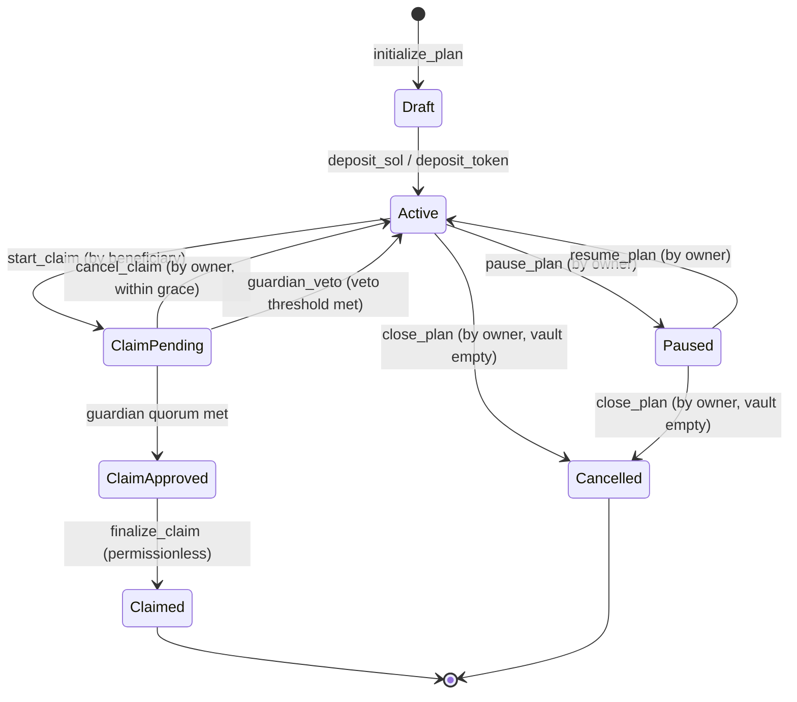
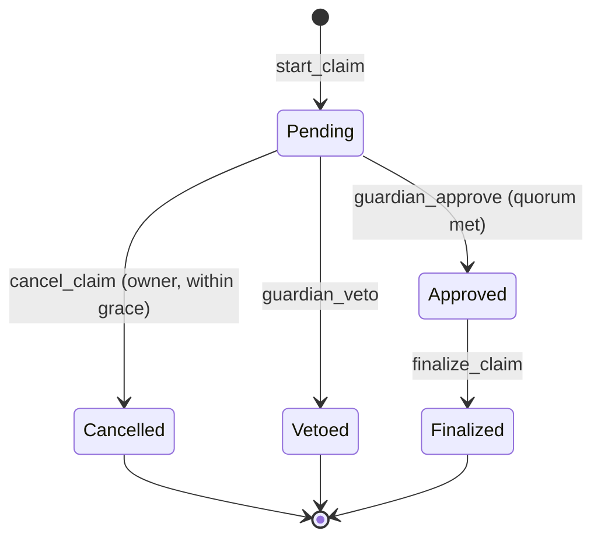
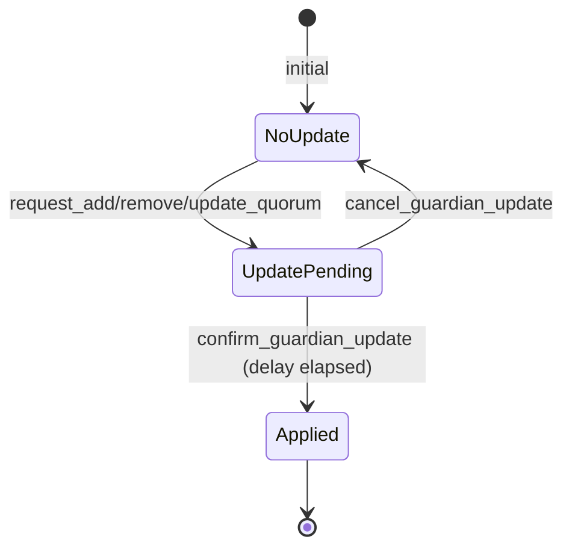
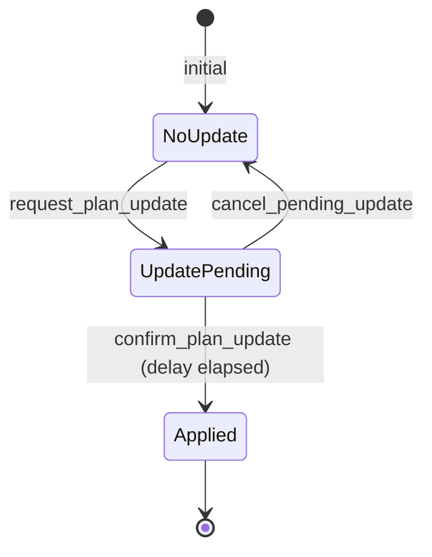

# State Machine

## Plan State Machine



## Plan States

| State | Description | Allowed Actions |
|-------|-------------|-----------------|
| **Draft** | Plan created, vault empty | deposit, heartbeat, update, close |
| **Active** | Funded, heartbeat running | heartbeat, deposit, pause, update, withdraw_emergency |
| **ClaimPending** | Beneficiary initiated claim | cancel_claim (owner), guardian_approve, guardian_veto |
| **ClaimApproved** | Guardian quorum met | finalize_claim |
| **Claimed** | Terminal: funds transferred | close accounts |
| **Cancelled** | Terminal: plan closed | close accounts |
| **Paused** | Temporarily suspended | resume, close |

## Claim State Machine



## Transition Guards

### start_claim
- Plan state = Active
- Signer = beneficiary OR backup_beneficiary
- `now > last_heartbeat + inactivity_duration`

### cancel_claim
- Plan state = ClaimPending
- Signer = owner
- `now < claim.started_at + grace_period`

### guardian_approve
- Plan state = ClaimPending
- Signer = registered guardian
- Guardian has not already approved or vetoed this claim
- Claim state = Pending

### guardian_veto
- Plan state = ClaimPending
- Signer = registered guardian
- Guardian has not already approved or vetoed this claim

### finalize_claim
- Claim state = Approved
- Grace period elapsed: `now >= claim.started_at + grace_period`
- Permissionless: any signer may invoke

## Timing Diagram

```
Owner creates plan              Beneficiary starts claim
│                              │
▼                              ▼
┌──────────────────────┐       ┌──────────────────┐        ┌─────────────┐
│    Active State      │       │  Grace Period     │        │  Finalizable│
│                      │       │                   │        │             │
│  Owner heartbeats    │       │  Owner can cancel │        │ Permissionless
│  periodically        │       │  Guardians vote   │        │ finalize    │
│                      │       │                   │        │             │
│  last_heartbeat ─────┼───────┼── + inactivity ───┼────────┼── + grace ──┤
│                      │       │    window         │        │   period    │
└──────────────────────┘       └──────────────────┘        └─────────────┘
```

## Guardian Update State Machine



### Guardian Update Guards

- **request_***: Signer = owner, no existing pending update
- **confirm_guardian_update**: Signer = owner, `now >= pending.requested_at + update_delay`
- **cancel_guardian_update**: Signer = owner, pending update exists

## Plan Update State Machine



### Updatable Plan Parameters (with delay)
- `beneficiary`
- `backup_beneficiary`
- `inactivity_duration`
- `grace_period`
- `emergency_bucket_lamports`

Parameters that do NOT require delay:
- `heartbeat` (always immediate)
- `pause` / `resume` (always immediate)
